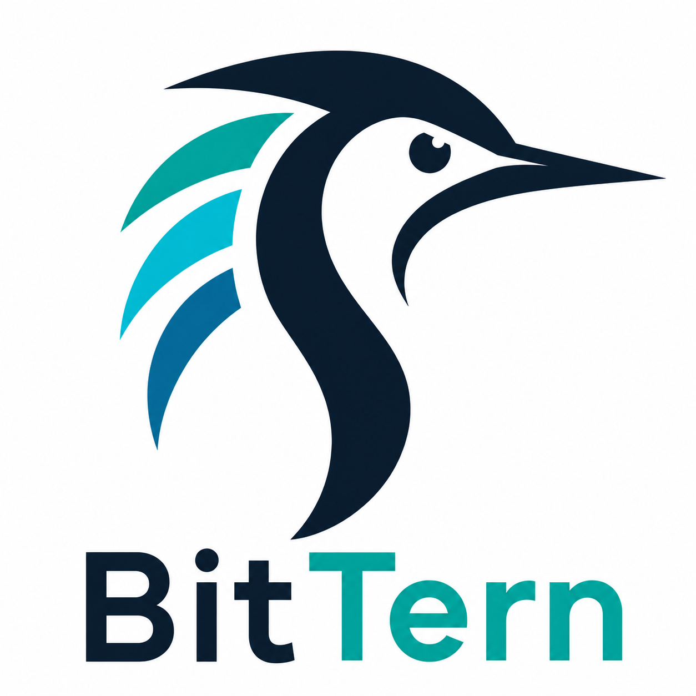

  

  <h3>An Open Toolkit for Post-Training Ternary Quantization: Research, Models, and Systems.</h3>

  

    
    
    
    
  

**BitTern** aims to provide low-cost, high-accuracy post-training ternary quantization tools, as well as 1.58-bit models across diverse architectures, model scales, and reasoning tasks. Its goal is to lower the barrier to entry for developing 1.58-bit models, enabling broader community participation and allowing everyone can contribute and benefit from shared tools and models.

## Latest News

- `[Planning]` We are in the process of open-sourcing **CAT-Q**.
- `[01/05/2026]`: 🎉🎉🎉**CAT-Q: Cost-efficient and Accurate Ternary Quantization for LLMs** is accepted to ICML 2026 as an oral.
