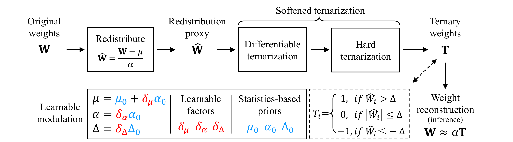
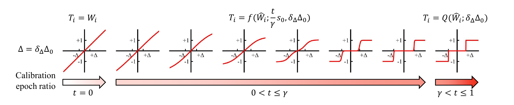
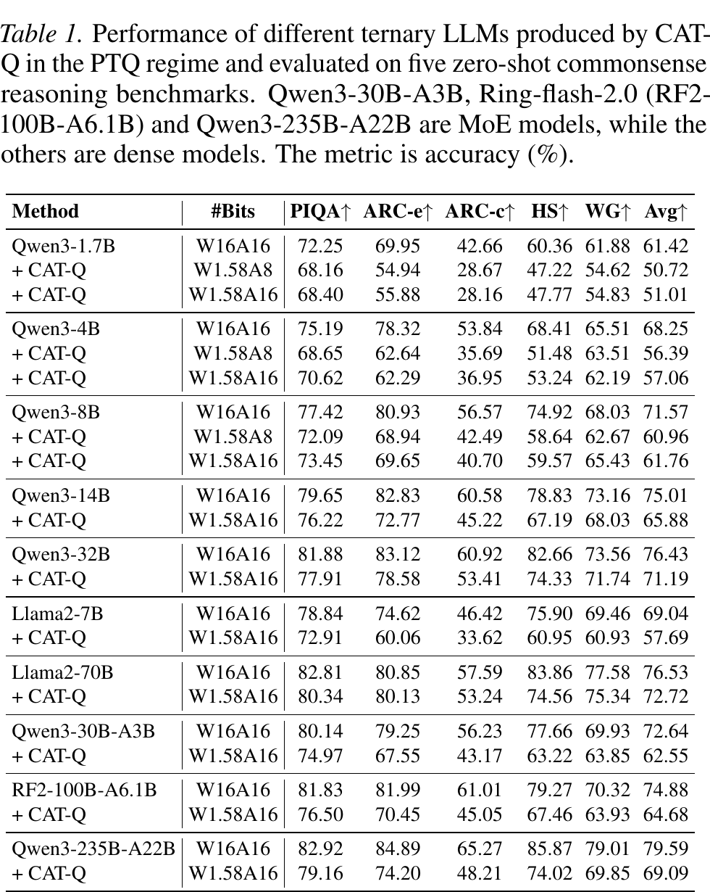
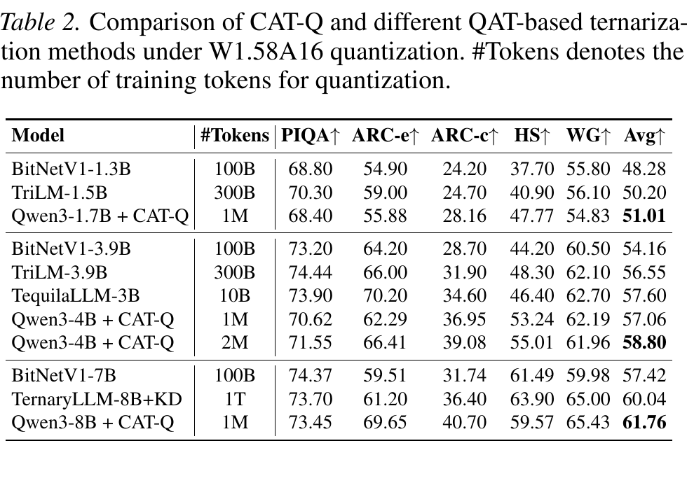

<h1 align="center">CAT-Q: Cost-efficient and Accurate Ternary Quantization for LLMs</h1>

<p align="center">
  Shigeng Wang · Chao Li · Yangyuxuan Kang · Jiawei Fan · Anbang Yao
</p>

<p align="center">
  <a href="https://arxiv.org/abs/2606.26650"></a>
  <a href="https://icml.cc/virtual/2026/oral/71111"></a>
  <a href="https://openreview.net/pdf?id=9uZJLXt7fq"></a>
  <a href="https://huggingface.co/IntelLabsChina/CAT-Q"></a>
</p>

This repository contains the official implementation of **CAT-Q**, accepted as an **ICML 2026 Oral**. CAT-Q converts pretrained LLMs into accurate ternary models through post-training quantization, without costly quantization-aware training.

## Latest News

- `[Stay tuned]` We are preparing to release the CAT-Q training code.
- `[22/07/2026]` We release the CAT-Q model checkpoints, inference, and evaluation code.
- `[25/06/2026]` The [CAT-Q paper](https://arxiv.org/abs/2606.26650) is available on arXiv.
- `[01/05/2026]` 🎉🎉🎉**CAT-Q: Cost-efficient and Accurate Ternary Quantization for LLMs** is accepted to ICML 2026 as an oral.

## Overview

<p align="center">
  
</p>

CAT-Q couples two components in a sliding-layer quantization pipeline:

- **Learnable Modulation (LM)** adapts the pretrained weight distribution, reconstruction scale, and ternary threshold with a small calibration set.
- **Softened Ternarization (ST)** transitions from differentiable ternarization to hard ternarization for stable convergence.

<p align="center">
  
</p>

Using only 512 calibration samples, CAT-Q scales W1.58 quantization from 1.7B dense models to 235B MoE models.

## Table of Contents

- [Latest News](#latest-news)
- [Overview](#overview)
- [Table of Contents](#table-of-contents)
- [Main Results](#main-results)
  - [Ternary Quantization Across Model Scales](#ternary-quantization-across-model-scales)
  - [Comparison with QAT-based Ternary LLMs](#comparison-with-qat-based-ternary-llms)
- [Model Zoo](#model-zoo)
- [Installation](#installation)
- [Evaluation](#evaluation)
- [Hugging Face Export](#hugging-face-export)
- [Citation](#citation)
- [Acknowledgement](#acknowledgement)
- [License](#license)

## Main Results

### Ternary Quantization Across Model Scales

<p align="center">
  
</p>

CAT-Q is evaluated on ten dense and MoE models from 1.7B to 235B parameters under W1.58A8 and W1.58A16 settings.

### Comparison with QAT-based Ternary LLMs

<p align="center">
  
</p>

For 1.7B-8B models, CAT-Q uses about 1M calibration tokens and remains competitive with ternary model families trained on 100B-1T tokens.

## Model Zoo

The following W1.58A16 checkpoints are available on Hugging Face:

| Model | Architecture | Hugging Face |
| --- | --- | --- |
| Llama2-7B | Dense | [llama2-7b](https://huggingface.co/IntelLabsChina/CAT-Q/tree/main/llama2-7b) |
| Qwen3-1.7B | Dense | [qwen3-1.7b](https://huggingface.co/IntelLabsChina/CAT-Q/tree/main/qwen3-1.7b) |
| Qwen3-4B | Dense | [qwen3-4b](https://huggingface.co/IntelLabsChina/CAT-Q/tree/main/qwen3-4b) |
| Qwen3-8B | Dense | [qwen3-8b](https://huggingface.co/IntelLabsChina/CAT-Q/tree/main/qwen3-8b) |
| Qwen3-14B | Dense | [qwen3-14B](https://huggingface.co/IntelLabsChina/CAT-Q/tree/main/qwen3-14B) |
| Qwen3-32B | Dense | [qwen3-32B](https://huggingface.co/IntelLabsChina/CAT-Q/tree/main/qwen3-32B) |
| Qwen3-30B-A3B | MoE | [qwen3-moe-30B-A3B](https://huggingface.co/IntelLabsChina/CAT-Q/tree/main/qwen3-moe-30B-A3B) |
| Qwen3-235B-A22B | MoE | [qwen3-moe-235B-A22B](https://huggingface.co/IntelLabsChina/CAT-Q/tree/main/qwen3-moe-235B-A22B) |

All checkpoints are hosted under [IntelLabsChina/CAT-Q](https://huggingface.co/IntelLabsChina/CAT-Q).

> **Note:** The code was refactored for open-source release, so checkpoint accuracy may differ slightly from the paper results (typically within ±0.2 percentage points).

## Installation

```bash
git clone https://github.com/IntelChina-AI/BitTern.git
cd BitTern/projects/cat-q

conda create -n catq python=3.10 -y
conda activate catq
pip install -e .
```

## Evaluation

This release provides CAT-Q model checkpoints, inference code, and evaluation code. Training code will be released separately.

1. Download `parameters.pth` from the [Model Zoo](#model-zoo) and place it next to the matching configuration:

   ```text
   configs/<model>/
   ├── config.yaml
   └── parameters.pth
   ```

2. Select the model in [`task_list.conf`](task_list.conf):

   ```bash
   result_dir=configs/qwen3-4b
   ```

3. Run evaluation:

   ```bash
   ./auto_test_one.sh
   ```

The launcher evaluates PIQA, ARC-Easy, ARC-Challenge, HellaSwag, and Winogrande through `lm-eval`, then writes the five per-task accuracies and their `avg-5` average to `results.csv`. Llama 2 requires access to the gated `meta-llama/Llama-2-7b-hf` repository.

## Hugging Face Export

Export the restored model as a fake-quantized Hugging Face model:

```bash
./export_model.sh
```

The exported model retains the original Hugging Face architecture and stores merged fake-quantized floating-point weights; it is not a packed ternary checkpoint.

## Citation

If CAT-Q is useful in your research, please cite:

```bibtex
@inproceedings{wang2026catq,
  title={CAT-Q: Cost-efficient and Accurate Ternary Quantization for LLMs},
  author={Wang, Shigeng and Li, Chao and Kang, Yangyuxuan and Fan, Jiawei and Yao, Anbang},
  booktitle={ICML},
  year={2026}
}
```

## Acknowledgement

CAT-Q is implemented based on [SliderQuant](https://github.com/deep-optimization/SliderQuant).

## License

CAT-Q is released under the [Apache License 2.0](LICENSE).
